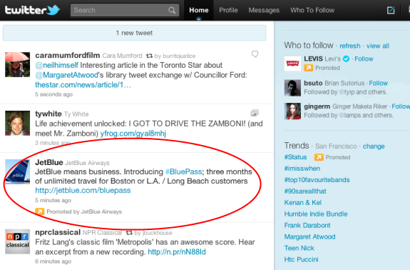
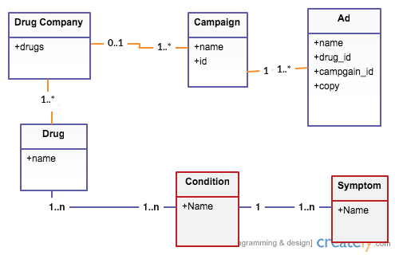
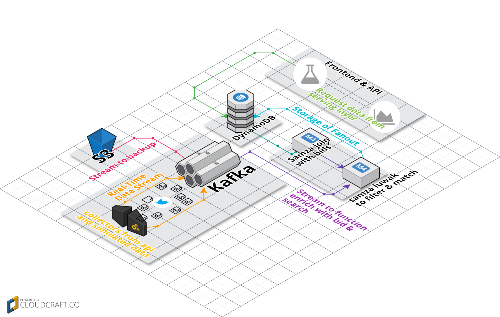
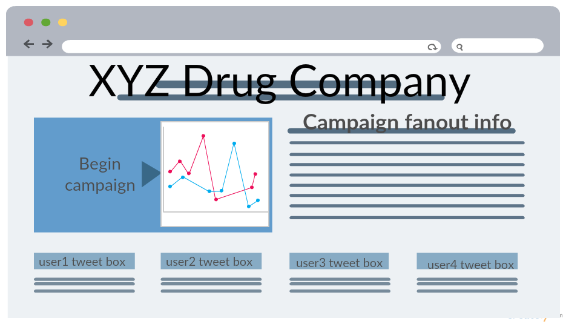

# Tweets.Rx

<!--

-->

#### Twitter Pharmaceuticals Ad Network

---

### User Story

As an ad network for pharmaceuticals on Twitter, I would like to be able to display my ads (along with a bid) to relevant users on Twitter. 

---

In this project, relevant user is defined based on the content of the users' tweet

---

#### Backloged features

- run batch jobs to find common symptoms that occur together (per condition)

---

### Data Model

---

#### [Current Stack](https://cloudcraft.co/view/54cdb7bf-5c7b-440f-9f5a-4878b34aba78?key=3m40jn0enpfd2t90)

---

## The jury is still out

- spark streaming vs samza

---

### Why Spark Streaming

- joins two batches that are in the same time interval

---

### Why Samza

- Table-table join
- Stream-table join
- Stream-stream join

---

Spark Streaming’s updateStateByKey approach to store mismatch events cannot handle large number of events, which causes the inefficience in Spark Streaming.

---

#### Samza Stream-table Join

Common in advertising, relevance ranking, fraud detection and other domains. 

Activity events such as page views generally only include a small number of attributes, such as the ID of the viewer and the viewed items, but not detailed attributes of the viewer and the viewed items, etc.

---

#### Frontend

---

## About Me

### Joyce Chan

B.Sc Computer Science and Math

Software engineer in social media & healthcare analytics, Sysomos, Marketing optimization startup.

